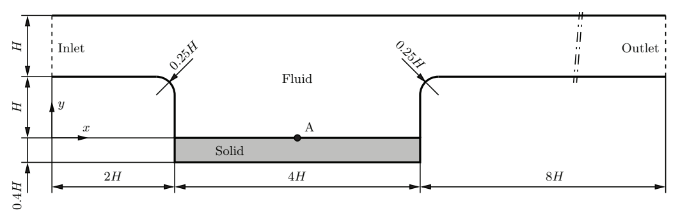
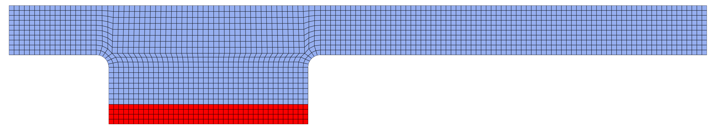
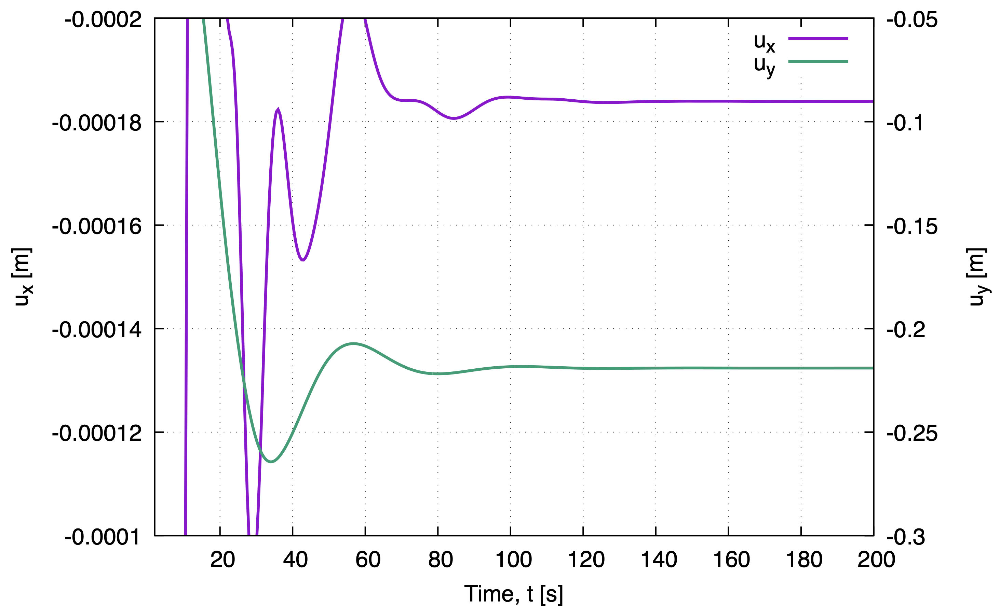
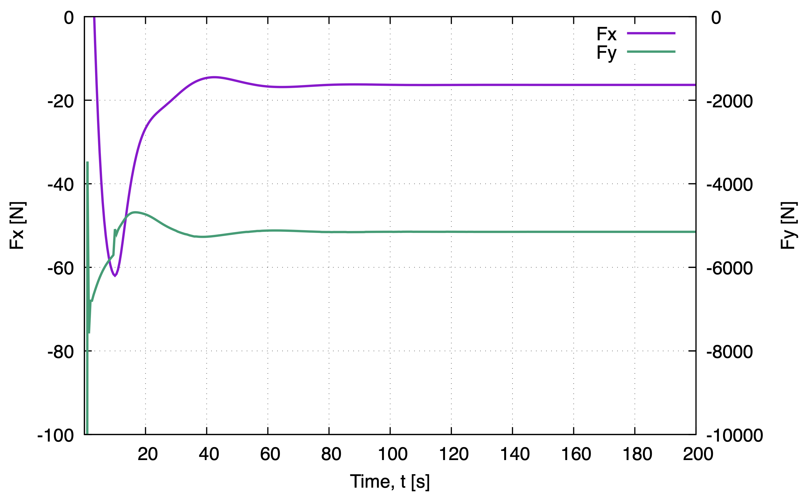
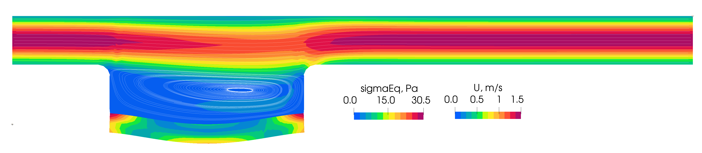
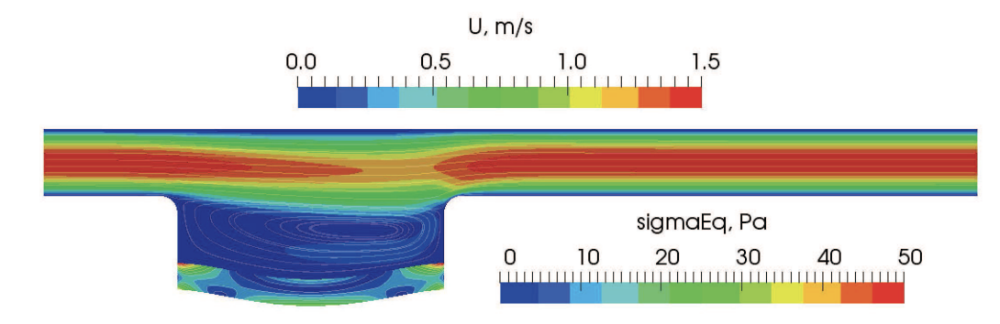
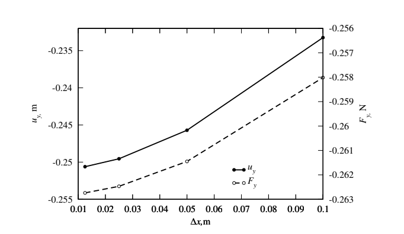

# Channel flow over a cavity with a flexible bottom: `cavityFlexibleBottom`

Prepared by Aaron Mullen-Hales, Philip Cardiff and Ivan Batistić

## Tutorial Aims

* Demonstrates how to perform an internal-flow fluid-solid interaction simulation

## Case Overview

This case involves a laminar flow of an incompressible fluid with a parabolic
 inlet velocity profile through a two-dimensional channel containing a flexible
cavity in the bottom wall. The geometry of the fluid and solid domains is
shown in Fig. 1. The channel height for all simulations is $$H = 1\,\mathrm{m}$$.
The fluid has a density of $$1\,\mathrm{kg/m^3}$$ and a kinematic viscosity of $$0.01\,\mathrm{m^2/s}$$.
It enters the channel from the left-hand side with a parabolic velocity profile
with a mean inlet velocity of $$1\,\mathrm{m/s}$$, corresponding to a Reynolds number
of $$Re = 100$$ based on the channel height. A constant pressure is imposed at the
outlet, and no-slip boundary conditions are applied at the channel walls. The
flexible elastic plate forming the bottom of the cavity has a density of $$1000\,\mathrm{kg/m^3}$$,
a Young’s modulus of $$500\,\mathrm{N/m^2}$$, and a Poisson’s ratio of
$$\nu = 0.4$$. Its deformation  is described using the Saint Venant–Kirchhoff
constitutive model. The case is solved as a transient problem until a
steady-state solution is reached. A first-order Euler time discretisation
scheme is used for both the fluid and solid solvers. To accelerate
convergence to the steady state and suppress transient oscillations, additional
damping is applied to the solid domain via the `dampingCoeff` parameter in `constant/solid/solidProperties`.

**Figure 1: Geometry of the spatial computational domain for
the channel flow over a cavity with a flexible bottom [1]**

**Figure 2: Computational domain discretisation: solid (red) and fluid (blue)**

---

## Running the case

The tutorial case is located at
`solids4foam/tutorials/fluidSolidInteraction/HronTurekFsi3`. The case can be run
using the included `Allrun` script, i.e. `> ./Allrun`. The `Allrun` script first
executes `blockMesh` for both `solid` and `fluid` domains
(`> blockMesh -region fluid` and `> blockMesh -region solid` ), and the
`solids4foam` solver is used to run the case (`> solids4Foam`). Optionally, if
`gnuplot` is installed, a file `deflection.pdf` will be created with the
displacement history of point A, and a file `force.pdf` will be created with the
history of the force on the interface.

---

## Analysing Results

The vertical displacement of point A (located at $$(4\,-1\,0)$$) is recorded in `postProcessing/0/solidPointDisplacement_displacement.dat`
 using a function object defined in `system/controlDict`. The forces acting
 on the fluid–solid interface are also recorded in
`postProcessing/fluid/forces/0/force.dat` via the `forces` function object.

Figure 3 shows the convergence history of the vertical displacement of point A,
while Fig. 4 presents the convergence of the interface force components.
As can be observed, a steady-state solution is reached after approximately
 $$t = 120\,\mathrm{s}$$.

Figure 5 shows the velocity field in the fluid domain together with the equivalent
stress distribution in the solid domain. The results are in good agreement
with those reported in [1] (see Fig. 6 therein). The results in [1] are
obtained using a finer mesh, which explains the higher stress values observed
near the plate corners due to stronger stress concentrations.

**Figure 3: Convergence of the horizontal and vertical displacement of point A**

**Figure 4: Convergence of the interface total force components**

**Figure 5: Velocity field in the fluid and equivalent stress
in the solid part at the final time step**

---

## Results from the literature

The results reported by [1] show good agreement with those obtained
 using `solids4foam`. Figure 6 presents the velocity field and equivalent
 stress distributions reported in [1], while Fig. 7 shows the corresponding
convergence histories of displacement and interface forces.

The interface force reported in [1] is several orders of magnitude smaller
 than that obtained in the present solids4foam simulation, which is explained
 by the different domain thickness used in the two studies.

For mesh with  $$0.1$$ m spacing, the vertical displacement reported in [1] is
approximately $$-0.232\,\mathrm{m}$$ (estimated from the published diagram),
whereas the solids4foam prediction is $$-0.219\,\mathrm{m}$$.

**Figure 6: Velocity field in the fluid and equivalent stress
in the solid part at the final time step, from [1].  Mesh spacing  0.025 m**

**Figure 6: Displacement of point A and force at the plate
as a funcion of cell size [1]**

---

## References

[1]
[Tuković, Ž., Karač, A., Cardiff, P., Jasak, H., and Ivanković, A.
OpenFOAM finite volume solver for fluid-solid interaction.
 Transactions of FAMENA, 42(3), 1-31. (2018)](https://doi.org/10.21278/TOF.42301)
