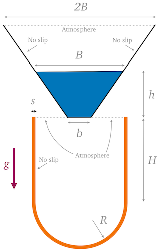
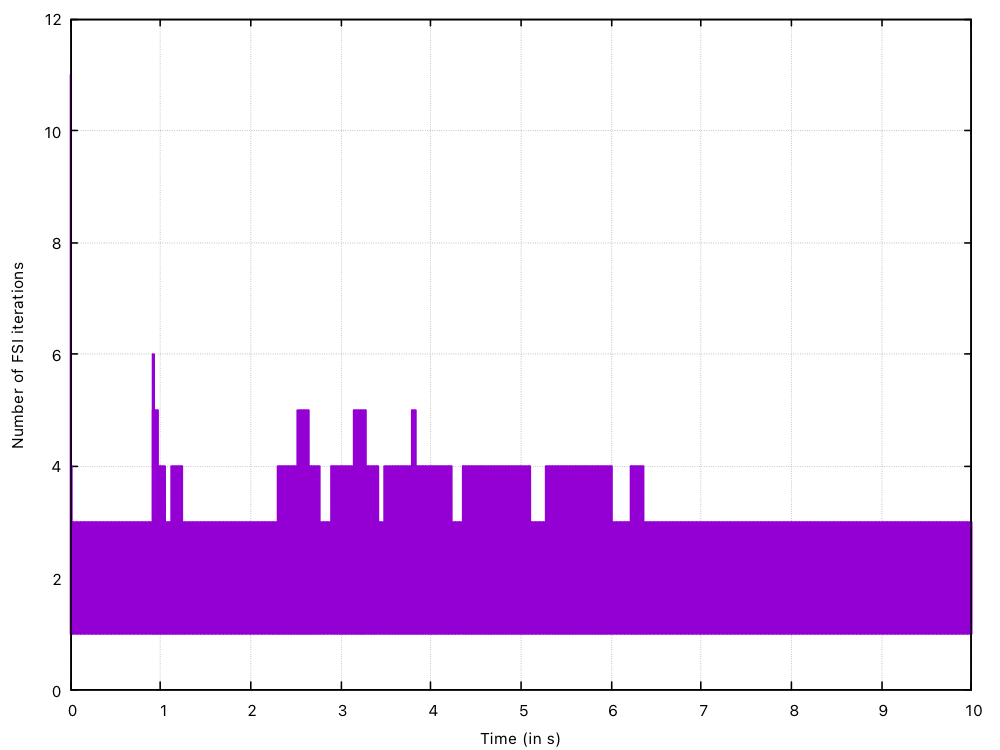

# Filling an elastic container with a viscous fluid: `fillingElasticContainer`

---

Prepared by Philip Cardiff, Amirhossein Taran, Ivan Batistić

---

## Tutorial Aims

- This tutorial case demonstrates two-phase fluid–structure interaction involving
  the filling of a highly deformable elastic container with a viscous fluid,
  where added-mass effects are prominent.

---

## Case Overview

The case is inspired by, and closely related to, the benchmark problems
 presented in the literature on Lagrangian and partitioned fluid-solid
 interaction methods [1-3]. In contrast to the original benchmark configurations,
 this implementation **explicitly includes two fluid phases (water and air)**. As
 a result, the behaviour is not strictly identical to the single-phase reference
 cases [1-3]; in particular, trapped air pockets may influence the subsequent
 fluid motion and solid deformation.

A volume of viscous fluid falls under gravity from a rigid reservoir into a thin,
 highly deformable, low-density elastic container (Figure 1). The impact and
 subsequent filling induce large deformations of the elastic structure, followed
 by chaotic oscillatory motion, before the system comes to a rest.

Key features of the problem:

- Strong two-way fluid–structure interaction
- Large solid deformations and displacements
- Free-surface flow
- Two-phase flow (water + air)
- Significant added-mass effects: fluid-to-solid density ratio of 50.

The problem geometry and material parameters are based on the benchmark studies
 from the literature [1-3], with adaptations required for the two-phase
 formulation used here. In particular, a second fluid (air) phase is assumed,
 and, consequently, atmospheric vents are added instead of walls at the top of
 the elastic container to allow the air to escape as the viscous fluid drops
 from the funnel.



**Figure 1: Fluid and solid Computational domains and boundary conditions.**

The default tutorial case contains a relatively coarse mesh with $$4\,000$$
 fluid cells and $$480$$ solid cells.

The adopted material parameters are given below:

### Table 1: Problem Physical Parameters

| Category | Parameter                               |       Value       | Units|
| :------: | :-------------------------------------- | :---------------: | :--: |
| Geometry | Rigid container top side                |       4.87        | m    |
|          | Rigid container bottom side, $$b$$      |       1.30        | m    |
|          | Rigid container height, $$h$$           |       2.50        | m    |
|          | Elastic container straight side, $$H$$  |       3.75        | m    |
|          | Elastic container cap radius, $$R$$     |       2.25        | m    |
|          | Elastic container thickness, $$s$$      |       0.20        | m    |
|          | Gravity, $$g$$                          |       9.81  | m/s$$^2$$ |
|  Solid   | Density, $$\rho_s$$                     |        20   | kg/m$$^3$$ |
|          | Young’s modulus, $$E_s$$                | $$2.1\times10^7$$ | Pa   |
|          | Poisson’s ratio, $$\nu_s$$              |        0.3        |      |
|  Fluid   | Phase 1 density, $$\rho_{f_1}$$         |       1000  | kg/m$$^3$$ |
|          | Phase 1 dynamic viscosity, $$\mu_{f_1}$$|        100        | Pa·s |
|          | Phase 2 density, $$\rho_{f_2}$$         |          1  | kg/m$$^3$$ |
|       | Phase 2 dynamic viscosity, $$\mu_{f_2}$$| $$1.48\times10^{-5}$$| Pa·s |
|          | Surface tension coefficient, $$\sigma$$ |          0        | N/m  |

---

## Numerical approach

- **Fluid:** two-phase incompressible flow (water + air) using an arbitrary
  Lagrangian-Eulerian volume of fluid formulation (`interFoam`)
- **Solid:** nonlinear hyperelastic total Lagrangian solid formulation with
  Jacobian-free Newton-Krylov solution algorithm [5]
- **Coupling:** partitioned FSI framework with Robin-Neumann coupling [4]
- **Time integration:** transient

Compared to the original single-phase benchmarks, the inclusion of air introduces
 additional physical effects, such as air entrapment dynamics, which can alter
 the transient response.

This case therefore serves both as:

- A reproduction (with modifications) of a well-established fluid-solid
  interaction benchmark, and
- A demonstration of two-phase fluid-solid interaction capabilities within
  solids4foam, where added-mass effects are prominent, i.e. when the fluid
  density is similar to or less than the solid density.

---

## Running the case

From the case directory:

```bash
./Allrun
```

To clean the case:

```bash
./Allclean
```

---

## Results

Typical fields of interest include:

- `alpha.water` (phase distribution)
- Displacement and deformation of the elastic container
- Fluid pressure and velocity fields

Video 1 shows the Time evolution of the phase distribution field in the fluid and
 the displacement magnitude field in the solid



**Video 1: Time evolution of the phase distribution field in the fluid and the
displacement magnitude field in the solid.**

A commonly reported metric for this benchmark is the vertical displacement of
 the container apex as a function of time. This data is recored in the case via
 the `solidPointDisplacement` function object, placed in `system/controlDict`.

```c++
functions
{
    disp
    {
        type    solidPointDisplacement;
        point   (0 -6.0 0);
    }
}
```

The `solidPointDisplacement` function object records the displacement history of
 the selected container apex point and write them to the file:

```bash
postProcessing/0/solidPointDisplacement_disp.dat
```

The displacement vs time are shown in Figure 2, where the results from two
 solids4foam mesh densities are shown; close agreement are seen with the
 single-phase results from the literature for the initial displacement spike.

![Figure 2: Displacement of the container apex point vs time. Adapted from [3].](./images/fillingElasticContainer-displacement.png)

**Figure 2: Displacement of the container apex point vs time.**

Figure 3 shows the number of fluid-solid interaction coupling iteration per time
 step (mesh with $$2\,000$$ fluid and $$400$$ solid cells), showing that the
 adopted partitioned Robin-Neumann coupling approach requires between 3 and 6
 iterations in all time steps apart from 11 in the first time step: this
 highlights the robustness and efficiency of the Robin-Neumann coupling approach
 in this high added-mass scenario.



**Figure 3: Number of fluid-solid interaction coupling iterations vs time.**

The original benchmark problems reported in the literature typically consider a
 single-phase viscous fluid, neglecting the presence of air.

In this solids4foam case:

- Air is explicitly modelled as a second phase.
- A full air pocket may become trapped during filling.
- This can lead to differences in:
  - transient pressure fields,
  - oscillation frequencies,
  - damping behaviour,
  - final equilibrium configuration.

As a result, while qualitative agreement with published results is expected, exact
 quantitative agreement should not be assumed.

---

## References

[1]
[A. Franci, E. Oñate, J. M. Carbonell, Unified Lagrangian formulation for solid and fluid mechanics and FSI problems, Comput. Methods Appl. Mech. Engrg., 298 (2016) 520–547.](http://dx.doi.org/10.1016/j.cma.2015.09.023)

[2]
[M. Meduri et al., A partitioned fully explicit Lagrangian finite element method for highly nonlinear fluid–structure interaction problems, Comput. Methods Appl. Mech. Engrg., 315 (2017) 388–421.](https://doi.org/10.1002/nme.560)

[3]
[M. Cerquaglia et al., A fully partitioned Lagrangian framework for FSI problems characterized by free surfaces, large solid deformations and displacements, and strong added-mass effects, Comput. Methods Appl. Mech. Engrg., 348 (2019) 202–233.](https://doi.org/10.1016/j.cma.2019.01.021)

[4]
[Tuković Ž, Bukač M, Cardiff P, Jasak H, Ivanković A, 2018, Added mass partitioned fluid–structure interaction solver based on a robin boundary condition for pressure. In: OpenFOAM selected papers of the 11th workshop. Springer, Berlin, pp 1–23](https://doi.org/10.1007/978-3-319-60846-4_1)

[5]
[P. Cardiff, D. Armfield, Ž. Tuković, I. Batistić, 2025, A Jacobian-free Newton-Krylov method for cell-centred finite volume solid mechanics, International Journal for Numerical Methods in Engineering, accepted](https://doi.org/10.48550/arXiv.2502.17217)
