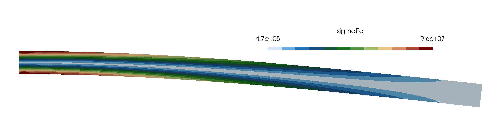

# Slender Cantilever in Bending: `cantilever2d`

Prepared by Philip Cardiff

---

## Tutorial Aims

- Verify the accuracy of solids4foam solid models for a slender cantilever in
  bending.
- Compare the performance of cell-centred and vertex-centred discretisatins and
  segregated and coupled solution algorithms for bending dominated scenarios.
- Demonstrates the slow convergence of the solution algorithm for high aspect
  ratio geometry undergoing bending.

## Case Overview

The test case geometry consists of a rectangular beam $$L \times D$$ m, where
 $$L = 2$$ m and $$D = 0.1$$ m, with a Young’s modulus $$E$$ of 200 GPa and a
 Poisson’s ratio ($$\nu$$) of 0.3. A uniform quadrilateral mesh with $$5\,120$$
 cells is employed. The beam is fixed on the left boundary and a load of
 $$100$$ kN is applied to the right. There are no body forces. The problem is
 solved as static, using one loading increment. From Timoshenko beam theory [1],
 the analytical solution for the $$x$$ and $$y$$ components of the displacement
 field are given as:

$$
u_x = -\frac{P y}{6 E I}
\left[
(6L - 3x)x + (2 + \nu)\left(y^2 - \frac{D^2}{4}\right)
\right], \\
u_y = -\frac{P}{6 E I}
\left[
3\nu y^2 (L - x) + (4 + 5\nu)\frac{D^2 x}{4} + (3L - x)x^2
\right]
$$

where $$I = \frac{D^3}{12}$$ m$$^4$$ is the second moment of area of the
 cross-section, and the origin is assumed at the centre of the fixed (left)
 boundary. The analytical stresses are

$$
\sigma_{xx} = \frac{P (L - x) y}{I}, \\
\sigma_{yy} = 0, \\
\tau_{xy} = -\frac{P}{2I} \left[ \frac{D^2}{4} - y^2 \right].
$$

For consistency with the analytical problem (see [1]), the analytical stress is
 applied to the right end of the bar, while the analytical displacement is
 applied to the left end.

A custom `cantileverAnalyticalSolution` function object is added to the
 `controlDict` to calculate the analytical solutions for displacement and stress
 and compute the errors:

```c++
functions
{
    cantileverAnalytical
    {
        type cantileverAnalyticalSolution;
        P 0.1e6;
        E 200e9;
        nu 0.3;
        L 2;
        D 0.1;
        cellDisplacement yes;
        pointDisplacement yes;
        cellStress yes;
        pointStress no;
    }
}
```

In solids4foam, there are several solid models which can solve this problem;
 here, four approaches are considered:

1. A **cell-centred** finite volume approach with a **Jacobian-free Newton-Krylov**
   solution algorithm [2]. This is the default approach in the case, and is
   selected by specifying `solidModel linearGeometryTotalDisplacement;` in `constant/solidProperties`,
   with `solutionAlgorithm PETScSNES;` in `linearGeometryTotalDisplacementCoeffs`.
2. A **cell-centred** finite volume approach with a **segregated** solution
   algorithm. This approach employs the same discretisation as in approach 1, but
   solves the governing equations using the more common (in OpenFOAM) segregated
   algorithm. This approach is selected by specifying `solidModel linearGeometryTotalDisplacement;`
   in `constant/solidProperties`, with `solutionAlgorithm implicitSegregated;` in
   `linearGeometryTotalDisplacementCoeffs`.
3. A **vertex-centred** finite volume approach with an **exact Jacobian coupled**
   solution algorithm [3]. This approach is selected by specifying `solidModel vertexCentredLinearGeometry;`
   in `constant/solidProperties`, with `solutionAlgorithm PETScSNES;` and
   `approximateJacobian no;` in `vertexCentredLinearGeometryCoeffs`.
4. A **cell-centred** finite volume approach with an **exact Jacobian coupled**
   solution algorithm [4].  This approach is selected by specifying `solidModel coupledUnsLinearGeometryLinearElastic;`
   in `constant/solidProperties`.

```note
Approach 4 uses simplified uniform displacement (left) and uniform traction
 (right) boundary conditions, which give similar results for coarse/medium meshes
 but converge to a slightly different result than the analytical solution.
```

---

## Running the Case

The tutorial case is located at `solids4foam/tutorials/solids/linearElasticity/cantilever2d`.
 The case can be run using the included `Allrun` script, i.e. `> ./Allrun`.  In
 this case, the `Allrun` script optionally takes an argument which specifies
 which specifies the solution approach:

```bash
./Allrun                # Defaults to approach 1 (petscSnes)
./Allrun petscSnes      # Approach 1
./Allrun segregated     # Approach 2
./Allrun vertexCentred  # Approach 3
./Allrun unsCoupled     # Approach 4
```

The `Allrun` script starts by updating the files in the case to match the
 selected approach; the following files are updated: `0/D`, `0/pointD`, `constant/solidProperties`,
 `system/fvSchemes`, and `system/fvSolution`. Subsequently, the mesh is
 created with `blockMesh`, following by running the solver `solids4Foam`.

---

## Results

The von Mises stress (`sigmaEq`) distribution for the mesh with $$320 \times 16$$
 cells is shown in Figure 1, generated with the default case settings.



**Figure 1: Von Mises stress distribution (deformation scale factor = 10).**

Table 1 lists the wall-clock times rounded to the nearest second for the
 different approaches, where the segregated approach is significantly slower
 than the coupled approaches for this problem ($$123$$ s vs $$1$$ s). Such
 significant differences in efficiency are typical other static problems where
 high aspect ratio geometry is undergoing bending. However, for transient cases
 or where the aspect ratio is lower or bending effects are small, then the
 segregated approach can provide similar (or better) efficiency than the coupled
 approaches.

### Table 1: Wall-clock time (in s)

| Approach | Mesh (# cells) | Time (in s) |
| -------- | -------------- | ----------- |
| 1        | 5120           | 1           |
| 2        | 5120           | 123         |
| 3        | 5120           | 1           |
| 4        | 5120           | -           |

---

## References

[1] [C.E. Augarde, A.J. Deeks, The use of Timoshenko’s exact solution for a
 cantilever beam in adaptive analysis. Finite Elements in Analysis and Design,
 44, 2008, 595–601, 10.1016/j.finel.2008.01.010.](http://www.doi.org/10.1016/j.finel.2008.01.010)

[2] [P. Cardiff, D. Armfield, Ž. Tuković, I. Batistić, A Jacobian-free Newton–Krylov
 method for cell-centred finite volume solid mechanics. *arXiv preprint arXiv:2502.17217*,
 2025.](https://arxiv.org/abs/2502.17217)

[3] [F. Mazzanti, P. Cardiff, Performance of a vertex-centred block-coupled finite
 volume methodology for small-strain static elastoplasticity. *Computers and Mathematics
 with Applications*, 195, 2025, 212–238, 10.1016/j.camwa.2025.10.019.](https://doi.org/10.1016/j.camwa.2025.10.019)

[4] [P. Cardiff, Ž. Tuković, H. Jasak, A. Ivanković, A block-coupled finite volume
 methodology for linear elasticity and unstructured meshes. *Computers and Structures*,
 175, 2016, 100–122, 10.1016/j.compstruc.2016.07.004.](https://doi.org/10.1016/j.compstruc.2016.07.004)
