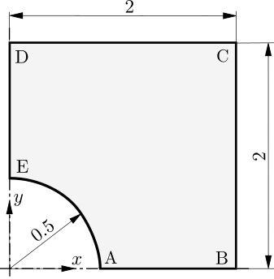

# Hole in a Infinite Plate Subjected to Remote Stress: `plateHole`

---

Prepared by Philip Cardiff and Ivan Batistić

---

## Tutorial Aims

- Demonstrate the solver accuracy for a linear elastic test case

---

## Case Overview

In this case, a thin, infinitely large plate with a circular hole is subjected to
uniaxial tension of $\sigma_{xx} = T = 1$ MPa, see Figure 1. Owing to the symmetry
of the geometry and loading, only one quarter of the plate is modelled.
To minimise the influence of the finite computational boundaries, the exact
tractions obtained from the analytical solution [1,2] are prescribed
on the outer edges BC and CD. They are defined with
 `analyticalPlateHoleTraction` boundary conditions, which require
geometry (hole radius) and loading (far-field  traction):

```c++
right
{
    type            analyticalPlateHoleTraction;
    farFieldTractionX 1e6;
    holeRadius      0.5;
    value           uniform (0 0 0);
}
```

Symmetry boundary conditions are applied on
boundaries AB and DE, while zero traction is specified on the hole boundary.
The material properties are defined by a Young’s modulus of $E = 200 GPa$
 and a Poisson’s ratio of $\nu = 0.3$. Gravitational and inertial effects are neglected,
and the case is solved using one loading increment.


Figure 1 - Problem geometry [3]

---

## Expected Results

The analytical solution for the stress field is [1,2]:

$$
\sigma_{xx} = T \left[ 1 - \dfrac{R^2}{r^2} \left( \dfrac{3}{2}\cos(2\theta)
+\cos (4\theta)\right) + \dfrac{3}{2}\dfrac{R^4}{r^4}\cos (4\theta) \right],
$$

$$
\sigma_{yy} = T \left[ - \dfrac{R^2}{r^2} \left( \dfrac{1}{2}\cos(2\theta)
-\cos (4\theta)\right) - \dfrac{3}{2}\dfrac{R^4}{r^4}\cos (4\theta) \right],
$$

$$
\sigma_{xy} = T \left[  - \dfrac{R^2}{r^2} \left( \dfrac{1}{2}\sin(2\theta)
+\sin (4\theta)\right) + \dfrac{3}{2}\dfrac{R^4}{r^4}\sin (4\theta) \right].
$$

where $r=\sqrt{x^2+y^2}$ and $\theta=\tan^{-1}(y/x)$ are the usual polar co-ordinates.
$R$ is the hole radius, .

A custom `plateHoleAnalyticalSolution` function object is added to the
 `controlDict` to calculate the analytical solutions for displacement and stress
 and compute the errors:

```c++
plateHoleAnalyticalSolution1
{
    type          plateHoleAnalyticalSolution;
    farFieldTractionX 1e6;    // Farfield sigma_xx
    holeRadius    0.5;        // Hole radius
    E             200e+9;     // Young modulus
    nu            0.3;        // Poissons ratio
}
```

The function object prints the average $L_1$, $L_2$, and $L_\infty$ norms for the
 stress components ($\sigma_{xx}$, $\sigma_{yy}$, and $\sigma_{xy}$) and for the
 displacement field:

```c++
Writing cellStressDifference field
    Component: 0
    Norms: mean L1, mean L2, LInf:
    3284.42 10421.2 105024

    Component: 1
    Norms: mean L1, mean L2, LInf:
    2100.42 6111.58 59602.5

    Component: 3
    Norms: mean L1, mean L2, LInf:
    2917.5 8547 87630.5

Writing DDifference field
    Norms: mean L1, mean L2, LInf:
    1.2549e-08 1.37329e-08 4.24642e-08
```

In `solids4foam` the error normas  $L_1$,$L_2$ and $L_\inf$ are defines as:
$$
L_1 =\frac{1}{N_{\text{c}}} \sum_{i=1}^{N_{\text{c}}} | \Delta \phi_i|,
$$

$$
L_2 = \sqrt{\frac{1}{N_{\text{c}}}\sum_{i=1}^{N_{\text{c}}} \Delta \phi_i^2},
$$

$$
L_{\infty} = \max_{1 \leq i \leq N_{\text{c}}} |\Delta \phi_i|.
$$

where $\Delta \phi_i$ is the difference between expected and predicted solutions
For variable $\phi$ at computational nodes and $N_{\text{c}}$ is the
overall number of computational nodes, i.e. cells.

---

## Running the Case

The tutorial case is located at
`solids4foam/tutorials/solids/linearElasticity/plateHole`. The case
can be run using the included `Allrun` script, i.e. `> ./Allrun`. In this case,
the `Allrun` consists of creating the mesh using `blockMesh` (`> ./blockMesh`)
followed by running the `solids4foam` solver (`> ./solids4Foam`) . Optionally,
the case can be run in parallel using `./Allrun parallel`

---

### References

[1]
[Demirdžić, I., Muzaferija, S., Perić, M.: Benchmark solutions of
some structural analysis problems using finite-volume method
and multigrid acceleration. International journal for numerical
methods in engineering 40(10), 1893–1908 (1997)](https://onlinelibrary.wiley.com/doi/10.1002/(SICI)1097-0207(19970530)40:10%3C1893::AID-NME146%3E3.0.CO;2-L)

[2]
[I. Demirdžić, and S. Muzaferija. "Finite volume method for stress
analysis in complex domains." _International journal for numerical _
methods in engineering_ 37: 3751-3766 (1994)](https://onlinelibrary.wiley.com/doi/abs/10.1002/nme.1620372110)

[3]
[I. Batistić, P. Castrillo and P. Cardiff. "A Jacobian-free Newton-Krylov
method for high-order cell-centred finite volume solid mechanics."
_arXiv preprint (2026)](https://arxiv.org/abs/2601.18417)
